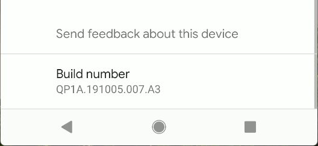
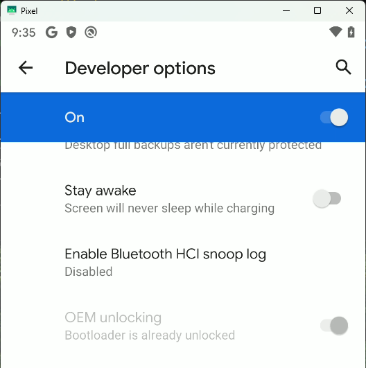

# Pixel Marlin/Sailfish Android 10 NAS Kernel

Build and safely test a custom Linux 3.18 kernel with built-in NFSv3 and CIFS/SMB2 support for the first-generation Google Pixel family:

- Pixel XL (`marlin`)
- Pixel (`sailfish`)
- Android 10 build `QP1A.191005.007.A3`

The project is intended for a dedicated, bootloader-unlocked, Magisk-rooted phone operating on a trusted LAN. It does not build or flash a complete Android operating system.

## Start here

The engineering plan is the authoritative procedure:

- [Action plan](Pixel_Marlin_Sailfish_Android10_RW_NAS_Kernel_Action_Plan.md)
- [Separated companion scripts](Pixel_Marlin_Sailfish_Android10_RW_NAS_Kernel_Scripts/)
- [Companion integrity manifest](Pixel_Marlin_Sailfish_Android10_RW_NAS_Kernel_Scripts/SHA256SUMS)

Do not substitute the old manual compile commands from earlier revisions. The current workflow locks the source and toolchain trees, builds out of tree, packages the kernel through the phone's installed MagiskBoot, proves a no-op repack, temporarily boots before flashing, and keeps an explicit-slot rollback image.

## Safety model

This work can make the phone unbootable and enables network-filesystem parsers in a kernel frozen in 2019. Read the complete action plan before connecting a phone.

The non-negotiable controls are:

1. Accept only `marlin` or `sailfish` on the exact Android build above.
2. Preserve the exact active rooted boot partition and its checksum before packaging.
3. Replace MagiskBoot's uncompressed kernel component—not blindly flash or insert `Image.lz4-dtb`.
4. Require the base rooted kernel to contain `want_initramfs`, then apply the matching Pixel 1 legacy-SAR `skip_initramfs` → `want_initramfs` patch to the custom kernel.
5. Temporarily boot both the no-op and custom images and require Magisk root after each.
6. Flash only the tested active slot, and only after the operator supplies the exact generated token.
7. Keep authoritative NAS photographs read-only at both the server and client.
8. Keep SMB/NFS on a trusted isolated LAN or VLAN; never expose either service to the internet.

The scripts do not invent confirmation tokens, reset supplied source checkouts, overwrite an existing rollback image, flash both slots, or run a factory-image installer.

## Recommended data flow

The supported Google Photos design is:

```text
read-only NAS source
        ↓
/data/local/tmp/nas-ro
        ↓  bounded, checksum-verified copy
/storage/emulated/0/DCIM/NAS-Inbox
        ↓  explicit MediaStore scan
Google Photos device-folder backup
```

Directly mounting a NAS share into Android's `/mnt/runtime/*` storage views is experimental. Android 10 uses per-app mount namespaces, separate storage views, SELinux, and MediaStore; a mount visible to root is not necessarily visible to Google Photos.

If phone-to-NAS writes are genuinely required, use a different root-only mount, NAS share, and least-privilege writer identity. Never give Google Photos write access to the authoritative NAS archive.

This project does not guarantee Google Photos entitlement, account behavior, indexing, or future service policy. Validate the exact account and app with a disposable image before relying on the workflow.

## Repository layout

```text
Pixel_Marlin_Sailfish_Android10_RW_NAS_Kernel_Action_Plan.md
Pixel_Marlin_Sailfish_Android10_RW_NAS_Kernel_Scripts/
  source-lock.env
  host-shell-lib.sh
  nas-kernel.config
  setup-host-ubuntu-20.04.sh
  build-kernel.sh
  device-package.sh
  device-deploy.sh
  90-nas-mount.sh
  test-nas-mount.sh
  install-nas-service.sh
  check-nas-namespace.sh
  verify-nas-service.sh
  unmount-nas.sh
  stage-photos.sh
  nas-mount-*.conf.example
  nas-smb.secret.example
  SHA256SUMS
```

Executable logic is intentionally kept out of the Markdown plan. The plan defines policy, ordering, evidence, and stop conditions; the companion directory contains the implementation.

Every host script that passes a complete command through `adb shell` to `su -c` sources `host-shell-lib.sh`; the regression suite rejects a return to hand-built nested single quotes.

## Host and build quick start

Use Ubuntu 20.04 as a normal user with `sudo` access. First verify the delivered scripts:

```bash
cd Pixel_Marlin_Sailfish_Android10_RW_NAS_Kernel_Scripts
sha256sum -c SHA256SUMS
./setup-host-ubuntu-20.04.sh
```

If the setup script adds the user to `plugdev`, log out and back in, then rerun it.

Build into a dedicated workspace:

```bash
export PIXEL_NAS_WORKSPACE="$HOME/pixel-nas-build-workspace"
./build-kernel.sh --workspace "$PIXEL_NAS_WORKSPACE" --jobs "$(nproc)"
```

The script automatically detects the three locked repositories when they are siblings of this repository. It validates them without fetching or writing to them, creates script-owned local clones under the workspace, and registers build worktrees only in those managed clones. This avoids another network download while preserving the supplied repositories' status and Git worktree metadata.

Repositories elsewhere can be supplied explicitly with the same isolation:

```bash
./build-kernel.sh \
  --workspace "$PIXEL_NAS_WORKSPACE" \
  --jobs "$(nproc)" \
  --kernel-repo ../android-kernel-msm \
  --aarch64-repo ../aarch64-linux-android-4.9 \
  --arm32-repo ../arm-linux-androideabi-4.9
```

Once a managed repository exists under a workspace, it remains authoritative for that workspace. If an explicit repository option is supplied on a later run, the script prints a warning that the option is ignored and directs the operator to use a new workspace to import it.

Verify the generated artifacts:

```bash
cd "$PIXEL_NAS_WORKSPACE/artifacts/common"
sha256sum -c SHA256SUMS
grep -E 'kernel_commit|kernel_release|supported_devices' build-manifest.txt
```

Expected outputs include:

- `Image`: uncompressed kernel used by the MagiskBoot packaging workflow
- `Image.lz4-dtb`: compressed build proof with appended device trees; not flashed directly
- `kernel.config` and `defconfig`
- `source-lock.env` and `build-manifest.txt`
- `SHA256SUMS`

## Device workflow

The phone must have an unlocked bootloader, USB debugging, authorised ADB access, and working Magisk root. Confirm the exact device and build before continuing:

```bash
adb devices
adb shell getprop ro.product.device
adb shell getprop ro.build.id
adb shell getprop ro.boot.slot_suffix
adb shell su -c id
```

From the companion directory, prepare the active-slot backup and device-specific images:

```bash
./device-deploy.sh prepare \
  --workspace "$PIXEL_NAS_WORKSPACE" \
  --device auto
```

Then temporarily boot the no-op image followed by the custom image:

```bash
./device-deploy.sh test \
  --workspace "$PIXEL_NAS_WORKSPACE" \
  --device auto
```

Stop if either temporary boot fails, Magisk root disappears, `uname -r` lacks `-nas1`, or NFS/CIFS is absent from `/proc/filesystems`.

Permanent flash and rollback are intentionally not abbreviated here. Follow Sections 8 and 11 of the action plan and use only the exact device/slot/hash-bound commands and tokens printed by `device-deploy.sh`.

## NAS testing

The production baseline is a read-only photo source. SMB requires a numeric IPv4 address, a dedicated non-administrator reader account, and a NAS that accepts SMB 3.0/3.02 without requiring SMB 3.1.1 or transport encryption. NFSv3 requires a numeric source address and the explicit `addr=<NAS_IP>` option supplied by the mount script.

Copy an example configuration outside the integrity-covered companion files, edit it, and run the manual test wrapper:

```bash
mkdir -p ../pixel-nas-operator-config
cp nas-mount-smb-ro.conf.example ../pixel-nas-operator-config/nas-mount.conf
cp nas-smb.secret.example ../pixel-nas-operator-config/nas-smb.secret
chmod 0600 ../pixel-nas-operator-config/nas-mount.conf \
  ../pixel-nas-operator-config/nas-smb.secret

# Edit the copied configuration and replace the placeholder secret securely.
./test-nas-mount.sh \
  ../pixel-nas-operator-config/nas-mount.conf \
  ../pixel-nas-operator-config/nas-smb.secret
```

The read-only test requires the exact source, filesystem type, and `ro` mode, then proves that a root write is rejected. NFS and isolated read/write examples are documented in Section 9 of the action plan.

Install a persistent Magisk service only after the corresponding manual test passes. The service uses a bounded TCP connection check against port 445 for SMB or 2049 for NFS, so NAS appliances that intentionally reject ICMP remain supported. After reboot, run `./verify-nas-service.sh`; it compares the mount from independent `su -mm` and plain `su` shells launched through adb instead of accepting only the service's own view. A pass establishes host-shell visibility only—it does not inspect Google Photos or any other app namespace.

## Validation status

Verified locally on 1 August 2026:

- exact repository origins, peeled refs, commits, and tree objects;
- complete out-of-tree kernel build with the locked GCC 4.9 toolchains;
- `Image`, `Image.lz4-dtb`, configuration, manifest, and artifact checksums;
- incremental rerun using existing local downloads without an unnecessary fetch;
- isolated local imports that leave supplied repository status and worktree metadata unchanged;
- a network-only fresh shallow-clone source-preparation run using `--no-local-autodetect --sources-only`;
- `shfmt` v3.13.1 shell formatting, ShellCheck v0.11.0 static analysis, and `rumdl` v0.2.47 Markdown formatting/linting;
- Bash/POSIX shell syntax and executable modes for the separated scripts;
- Bash/Dash regression coverage for conditional functional-probe failures;
- companion `SHA256SUMS` coverage and verification.

The successful build reported kernel release `3.18.137-nas1+`. The trailing `+` is expected for this clean detached Git worktree; acceptance requires the `-nas1` marker.

Not yet physically validated:

- MagiskBoot packaging on a Pixel;
- no-op or custom `fastboot boot`;
- permanent flash or rollback;
- SMB/NFS mounts against a NAS;
- Android mount-namespace and SELinux behavior;
- MediaStore indexing and Google Photos upload;
- NAS-off boot and overnight Wi-Fi/Doze behavior.

These are mandatory acceptance gates, not optional follow-up work.

## Formatting

All Bash and POSIX shell scripts are formatted with [`shfmt`](https://github.com/mvdan/sh), statically checked with [ShellCheck](https://github.com/koalaman/shellcheck), and Markdown is formatted and linted with [`rumdl`](https://github.com/rvben/rumdl). The repository pins shfmt v3.13.1, ShellCheck v0.11.0, and rumdl v0.2.47, then verifies the official Linux release SHA-256 values before installing each tool under the ignored `.tools/` directory.

Run both formatters after every shell or Markdown edit:

```bash
make format
```

Run every non-mutating quality and regression check before committing:

```bash
make check
```

The individual formatting targets are `format-shell`, `check-shell-format`, `format-markdown`, and `check-markdown`; `check-shellcheck` runs static analysis. Policy is stored in `.editorconfig` and `.rumdl.toml`; `shfmt` detects Bash and POSIX dialects from each script's shebang. GitHub Actions runs `make check` whenever Markdown, shell scripts, tests, or quality configuration changes.

## Device identification

Enable Developer options by tapping **Settings → About phone → Build number** seven times, then inspect **Settings → System → Advanced → Developer options → OEM unlocking**.





If OEM unlocking cannot be enabled, do not use this kernel deployment workflow.

The following seller photograph records only the physical source of the project phone; it is not evidence of model, storage capacity, bootloader state, or working condition. Verify those properties on-device.


## Historical references

- [AOSP marlin kernel source](https://android.googlesource.com/kernel/msm)
- [Pixel Backup Gang](https://github.com/master-hax/pixel-backup-gang)
- [Pixel 1 Android 10 kernel compilation notes](https://reao.io/330)

Primary technical references for the source lock, Magisk legacy-SAR behavior, Android storage views, CIFS/NFS limitations, ADB quoting, Termux, and Google Photos are maintained in Appendix C of the action plan.
