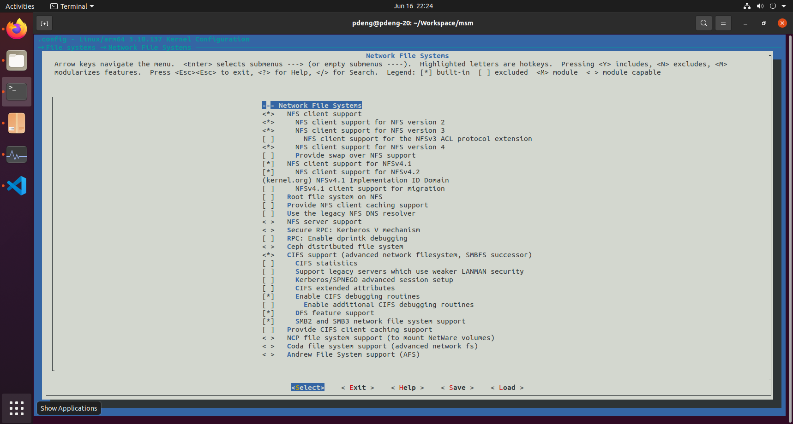

# Custom Android 10 Read/Write NAS Kernel

**Google Pixel (sailfish) and Pixel XL (marlin)**  
Idempotent Ubuntu 20.04 build, safe boot-image deployment and rollback, read-only NAS photo ingestion, isolated read/write NFS/CIFS capability, Termux operation, and Google Photos integration

| **Android build**    | QP1A.191005.007.A3                                        |
|----------------------|-----------------------------------------------------------|
| **AOSP tag**         | android-10.0.0_r17                                        |
| **Kernel commit**    | 72a7a64494e033f2213c9701dbf137d277bf2026                  |
| **Kernel tree**      | 63ce32df0c874adf430fe54c83bc786c78fcfd95                  |
| **Host**             | Ubuntu 20.04 LTS                                          |
| **Issued**           | 1 August 2026                                             |
| **Mount policy**     | Read-only photo source by default; separate root-only read/write staging share when required; SMB3.0 primary, NFSv3 alternative |
| **Plan revision**    | 2026-08-01-r5-review-hardening                           |
| **Companion implementation** | `Pixel_Marlin_Sailfish_Android10_RW_NAS_Kernel_Scripts/`; separated from this report and integrity-covered by `SHA256SUMS` |

> **Validation status**
>
> The Android build mapping, kernel branch, exact commit and tree, toolchain revisions, Kconfig selections, legacy-SAR Magisk requirement, NFS `addr=` requirement, CIFS dialect ceiling, Android storage-view model, and shell-command quoting risks were checked against the locked source and primary documentation. On 2026-08-01, the separated `build-kernel.sh` was executed end to end against the three local locked repositories; it produced and checksum-verified `Image`, `Image.lz4-dtb`, the resolved/minimised configurations, source lock, and build manifest. Both isolated local import and network-only fresh shallow-clone source-preparation paths were exercised. All companion shell scripts were formatted with pinned `shfmt` v3.13.1, checked with pinned ShellCheck v0.11.0, and reviewed for target validation, source/type/mode checks, explicit flash/rollback tokens, one-slot writes, bounded probe deletion, and secret-file permissions. Repository Markdown was formatted and linted with pinned `rumdl` v0.2.47. On 2026-08-02 the device scripts were executed against a Pixel (sailfish): kernel flashed, NAS mounted read-only over SMB 3.0, mount surviving reboot and network loss, one photo uploaded to Google Photos at original quality. Rollback, NFSv3 against a real export, the direct shared-storage mount and NAS-off boot remain unexercised.

Prepared for a first-generation Google Pixel family device with an unlocked bootloader. The phone described in the request - Pixel XL 128 GB - is marlin. The same plan also supports sailfish through device auto-detection and separate device/slot-specific boot packaging.

# How to use this report

Read Sections 1 through 4 before running anything. Sections 5 through 8 form the executable build and deployment path. Sections 9 through 11 cover NAS operation, Google Photos behaviour, and recovery. Appendix A maps every companion script to its responsibility; Appendix B records the immutable source lock; Appendix C lists primary references.

| **Section**                             | **Purpose**                                                                     |
|-----------------------------------------|---------------------------------------------------------------------------------|
| Executive decision                      | Recommended design, scope, and non-negotiable safety controls                   |
| 1\. Device and platform identification  | Distinguish marlin from sailfish and prevent cross-flashing                     |
| 2\. Assumptions and prerequisites       | Root/Magisk, host, cable, NAS, and human checkpoints                            |
| 3\. Validated source lock               | Exact branches, tags, commits, trees, and output format                         |
| 4\. Kernel configuration                | Exact NFS and CIFS/SMB symbols, built-in policy, and verification               |
| 5\. Ubuntu 20.04 host setup             | Install adb, fastboot, USB rules, and build dependencies idempotently           |
| 6\. Idempotent build procedure          | Reuse existing repositories, protect user changes, and generate artifacts       |
| 7\. Boot packaging and backup           | Dump the active boot slot; prove no-op repack; preserve DTBs/ramdisk; patch legacy SAR |
| 8\. Temporary test, flash, and rollback | Reversible test first, one-slot flash only, deterministic recovery              |
| 9\. NAS mounting                        | Read-only ingestion plus isolated SMB3.0/NFSv3 writes, credentials, verification, unmount, and service policy |
| 10\. Google Photos integration          | Reliable local staging baseline, explicit MediaStore scan, and experimental direct-mount validation |
| 11\. Human and AI execution contract    | Checkpoints, expected evidence, stop conditions, and troubleshooting            |

> **Destructive gates**
>
> An AI agent may run read-only checks, install missing host packages with authorised sudo, validate sources, and build. It must stop for ADB RSA approval, bootloader inspection, permanent flash, and rollback. Managed-worktree changes are never discarded automatically. It must never invent a flash or rollback confirmation token.

# Executive decision and recommended design

The kernel build is reproducible and the network-filesystem capability is delivered as a custom boot image for the last Android 10 build released for the first-generation Pixel family. End-to-end Google Photos operation was demonstrated on 2026-08-02: a photo read from a read-only NAS mount, staged locally, indexed by MediaStore and uploaded at original quality. It remains a single verified path, not a guarantee about Google account policy. The plan does not build or flash an entire Android operating system. It rebuilds the locked Linux 3.18 kernel, replaces the kernel inside the phone's current boot image, preserves the exact ramdisk and DTB layout, reapplies the Pixel 1 legacy-SAR Magisk kernel patch, tests that image non-persistently where the bootloader allows it, and only then permits a one-slot boot-partition flash. Where the bootloader refuses to RAM-boot any image, branch B of the deployment policy applies instead.

| **Decision area** | **Selected approach** | **Reason** |
|---|---|---|
| Device coverage | Pixel XL `marlin` and Pixel `sailfish` | One common locked kernel build; device-specific boot image, serial, slot, and rollback records |
| Primary NAS protocol | SMB3.0/CIFS with a dedicated read-only photo account; separate writer account only for an isolated upload share | Consumer NAS permissions and auditing are usually easier to administer with named accounts and share ACLs |
| NFS alternative | NFSv3 over TCP with explicit `addr=<NAS_IP>`; read-only export for ingestion and a separately mapped writable export only when needed | Android's direct mount path has no `mount.nfs` helper, and writable NFS requires deliberate server-side UID/GID or squash mapping |
| NAS data boundary | Authoritative photo source exposed read-only; optional dedicated writable staging share is never the only archive copy | Structurally prevents Photos or cleanup actions from deleting source photographs while retaining controlled phone-to-NAS capability |
| NAS recovery | Snapshots, recycle bin/versioning, or an independent backup before real writes | A writable remote filesystem extends phone-side mistakes to NAS data |
| Kernel linkage | NFS and CIFS built into the kernel | Avoids module ABI, module loading, signing, and early-boot availability problems |
| Supported mount location | Root-only `/data/local/tmp/nas-ro` for photo input and `/data/local/tmp/nas-rw` for optional output | Reliable kernel mount locations that do not depend on Android shared-storage view propagation |
| Google Photos path | Local `/storage/emulated/0/DCIM/NAS-Inbox` populated in bounded batches from the read-only source | Uses the supported local shared-storage/MediaStore path and keeps Photos away from remote write authority |
| Direct-mount experiment | `/mnt/runtime/{default,read,write}/emulated/0/DCIM/NAS-Inbox`, only after inspecting the exact phone mount table | Android 10 exposes different storage views to different app namespaces; success is not assumed |
| Automation | Separate Magisk `service.d` policies: read-only source mount by default; optional root-only writer with an effective-`rw` check and write probe | Late execution with a bounded reachability wait; NAS-off boot remains a physical acceptance test |
| Deployment | `fastboot boot`, then one-slot flash; branch B where the bootloader refuses to RAM-boot | Reversible acceptance test before persistent change wherever possible; other slot remains untouched |
| Rollback | Verified dump of the active boot partition | Restores the exact root/ramdisk state that was running before the change |

## What is and is not being backed up

A full automatic phone backup is **not necessary inside this kernel-only script**. The workflow does not run a factory-image installer, wipe userdata, or flash a complete OS. A complete app/private-data backup also cannot be reliably guaranteed through ordinary adb on Android 10.

The script nevertheless makes a boot-level rollback package mandatory before permanent flashing. It dumps the currently active `boot_a` or `boot_b` partition, verifies its SHA-256 checksum, records device/build/slot/serial state, and prints the exact rollback command. You must separately copy irreplaceable photographs, documents, authenticator recovery codes, and similar user data off the phone before authorising a persistent flash.

Any optional writable NAS staging share needs a separate recovery layer. Before the first real write, enable snapshots, a recycle bin or file versioning, or an independent backup and prove that a disposable file can be restored. RAID by itself does not protect against deletion or application mistakes. The authoritative photo source remains read-only.

## Most convenient daily mounting method

**1.** Create a read-only photo source such as `pixel-photo-source`. If writes are required, create a different shared folder such as `pixel-phone-stage`; treat it as an inbox/work area, not as the only copy of any data.

**2.** Create a non-administrator read-only account such as `pixel_nas_reader` for the authoritative photo source. If phone-to-NAS writes are required, create a separate `pixel_nas_writer` account restricted to a different staging/upload share. Deny guest access and unrelated shares.

**3.** Enable server-side recovery before the first real write to the optional staging share: snapshots, recycle bin/versioning, or an independent backup. Test one restore.

**4.** Prefer SMB3.0 for production. Use `vers=3.0`, `sec=ntlmssp`, a dedicated read-only account for the photo source, and a separate writer account only for a staging/upload share. The locked client supports SMB dialects only through 3.02 and does not implement SMB3 transport encryption; the NAS must allow SMB 3.0/3.02 without requiring encrypted transport. Never enable SMB1.

**5.** Retain NFSv3 as an alternative. Every direct Android NFS option list must include `addr=<numeric-NAS-IP>`. Restrict exports to the Pixel's reserved IP; keep the photo export read-only and map any separate writable export to a dedicated non-root server identity.

**6.** Install a Magisk `service.d` mount only after manual isolated tests succeed. A read-only service must validate `ro` and prove write rejection. A separate writable service must validate `rw` and repeat a disposable create/read/append/rename/delete probe.

**7.** Use root-only NAS plus bounded local staging as the supported Google Photos design. Direct mounting into Android's runtime storage views is experimental and must never be the only documented route to completion.

**8.** Use Termux for manual tests and on-demand mount/unmount commands. Termux does not itself grant mount permission: every kernel mount or unmount must run through Magisk `su -mm` so it occurs in the global mount namespace. Keep the Magisk `service.d` method as the preferred unattended daily mode after manual tests pass.

> **Critical deletion warning**
>
> Google Photos documents that **Free up space on this device** deletes device copies. A NAS file exposed through a writable path under shared storage may be treated as a device copy. Do not use **Free up space**, **Delete from device**, or bulk file-manager cleanup against important NAS content until a sacrificial-file test and server-side restore test prove the exact behaviour of this unsupported arrangement.

---

> **Important limitation**
>
> A successful root mount and root write do not prove an ordinary Android app can see the same path. Android 10 uses distinct default/read/write storage views and per-app mount namespaces; MediaStore, app permissions, and SELinux remain separate gates. Root-only NAS plus local staging is therefore the baseline, not merely a fallback.

# 1. Device and platform identification

The retail product name determines the device codename. Storage capacity does not change it.

| **Retail model**      | **Codename** | **This report**                                       |
|-----------------------|--------------|-------------------------------------------------------|
| Google Pixel XL       | marlin       | Supported; this is the phone described in the request |
| Google Pixel          | sailfish     | Supported                                             |
| Any later Pixel model | other        | Rejected by the scripts                               |

## 1.1 Identify the phone while Android is running

``` bash
adb devices
adb shell getprop ro.product.device
adb shell getprop ro.product.model
adb shell getprop ro.build.id
adb shell getprop ro.build.version.release
adb shell getprop ro.boot.slot_suffix
adb shell uname -r
```

For the Pixel XL described in the request, the critical result is marlin, build QP1A.191005.007.A3, Android version 10, and slot suffix \_a or \_b. For a Pixel, the device value must be sailfish. Any different build or device is a hard stop.

## 1.2 Confirm again in Fastboot

``` bash
adb reboot bootloader
fastboot devices
fastboot getvar product 2>&1
fastboot getvar current-slot 2>&1
fastboot getvar unlocked 2>&1
```

The deployment script repeats this check immediately before temporary boot, permanent flash, and rollback. It also records the adb/Fastboot serial number so a second phone of the same model cannot silently reuse another device's deployment state.

## 1.3 Why one kernel build can support both devices

Google groups the first-generation Pixel family under the marlin kernel source lineage. The locked source uses marlin_defconfig and produces Image.lz4-dtb. The companion build script therefore creates one common kernel artifact for marlin and sailfish. Device trees are included in that combined image; packaging remains phone-specific.

> **Do not confuse common kernel source with interchangeable boot images**
>
> A marlin boot image must never be flashed to sailfish, and a sailfish boot image must never be flashed to marlin. Header values, ramdisk/root modifications, current slot, and rollback data are taken from the exact connected phone. The scripts store them under device-, build-, serial-, and slot-validated state.

# 2. Assumptions, prerequisites, and stop conditions

## 2.1 Required phone state

**\[ \]** Bootloader is unlocked.

**\[ \]** Android reports build QP1A.191005.007.A3 and version 10.

**\[ \]** The device codename is marlin or sailfish.

**\[ \]** USB debugging is enabled and the host RSA prompt can be approved.

**\[ \]** Magisk/root is available: adb shell su -c id returns uid=0(root).

**\[ \]** The phone can enter Fastboot using adb or hardware keys.

**\[ \]** Battery is adequately charged and a reliable USB cable/port is available.

> **Unlocked bootloader is not root**
>
> The packaging, active boot-partition backup, global mount-namespace tests, and service.d automation in this plan assume Magisk root. If su does not return UID 0, stop. Do not substitute an arbitrary boot-image unpacker or attempt block-device reads without a separately validated root/packaging method.

## 2.2 Required Ubuntu host state

**\[ \]** Ubuntu 20.04 LTS, run as a normal user with sudo access.

**\[ \]** Enough free disk space for three Git repositories, worktrees, build output, and artifacts; allow approximately 15-25 GB.

**\[ \]** Reliable internet access only when a locked repository/ref is not already available locally.

**\[ \]** USB access through plugdev and Android udev rules.

**\[ \]** A persistent workspace path, for example \$HOME/pixel-nas-kernel-work.

## 2.3 NAS prerequisites

**[ ]** NAS and Pixel are on a trusted LAN or isolated VLAN; neither NFS nor SMB is exposed directly to the internet.

**[ ]** The Pixel has a DHCP reservation or static LAN address.

**[ ]** The Pixel can open the NAS service's IPv4 TCP port: 445 for SMB or 2049 for NFS. The companion mount script uses this accurate bounded readiness gate rather than requiring ICMP echo.

**[ ]** A read-only source share exists for NAS-to-Photos ingestion. If writes are required, a separate writable staging share such as `pixel-phone-stage` exists and is not the only copy of any data.

**[ ]** Snapshots, recycle bin/versioning, or an independent backup is enabled for the staging share, and a disposable restore has been tested.

**[ ]** For SMB, dedicated non-admin reader and optional writer accounts are restricted to their respective shares; guest access is denied; the server permits SMB 3.0 or 3.02 and does not require SMB 3.1.1 or encrypted transport from this client.

**[ ]** For NFS, the photo export is Read Only for the Pixel's reserved IP. Any separate writable export maps requests to a dedicated writable non-root server-side UID/GID or equivalent NAS identity.

**[ ]** A disposable test directory and one known test image are available for checksum, write, deletion, recovery, MediaStore, and Google Photos validation.

## 2.4 Hard stop conditions

| **Condition**                                            | **Required response**                                                                     |
|----------------------------------------------------------|-------------------------------------------------------------------------------------------|
| Device/build mismatch                                    | Stop. Do not package or flash.                                                            |
| Unexpected Git origin/ref/commit/tree                    | Stop. Inspect the source; never force the lock to match an unknown tree.                  |
| Dirty script-managed worktree                            | Stop and preserve it. Inspect the changes, then use a different workspace; the script never resets it. |
| Boot backup checksum failure                             | Stop. Preserve the files and investigate; never overwrite automatically.                  |
| Custom image fails temporary boot, or boot-loops         | Return to Fastboot; do not perform permanent flash. Branch A of the deployment policy.    |
| `fastboot boot` refused for every image, no-op included  | Bootloader limitation. `test` records evidence; see the deployment policy and 8.3.1.      |
| Custom kernel lacks NFS/CIFS runtime evidence            | Stop and rebuild; do not continue to NAS tests.                                           |
| Writable target is the only archive copy or uses admin login | Stop. Create a dedicated least-privilege staging share/account.                         |
| NAS recovery has not been tested                           | Stop before real files. Establish snapshot/recycle-bin/versioned or independent recovery. |
| Intended read-only mount accepts a write                    | Stop. Correct both server account/export and client mode before exposing source photos.    |
| Intended writable mount reports `ro` or the write probe fails | Stop. Correct server ACL/export mapping or client options; do not weaken unrelated access. |
| Google Photos cannot see a controlled direct-mounted test folder | Use the supported root-only NAS plus local-staging path; do not assume a larger remote library will work. |
| Unresolved SELinux AVC denials                           | Collect evidence and use local staging. Treat any narrow policy change as a separate audited task; never leave SELinux permissive. |

# 3. Validated source lock

The AOSP build table maps QP1A.191005.007.A3 to android-10.0.0_r17 for Pixel XL and Pixel. The official android-msm-marlin-3.18-android10 branch resolves to the full commit matching the phone's g72a7a64494e suffix, and that commit has the tree object recorded below. The lock file also pins both GCC 4.9 prebuilts used by Google's marlin build configuration.

## 3.1 Android and kernel lock

| **Android build**     | QP1A.191005.007.A3                          |
|-----------------------|---------------------------------------------|
| **AOSP tag**          | android-10.0.0_r17                          |
| **Kernel repository** | <https://android.googlesource.com/kernel/msm> |
| **Primary branch**    | android-msm-marlin-3.18-android10           |
| **Release branch**    | android-msm-marlin-3.18-android10-release   |
| **Commit**            | 72a7a64494e033f2213c9701dbf137d277bf2026    |
| **Tree**              | 63ce32df0c874adf430fe54c83bc786c78fcfd95    |
| **Defconfig**         | marlin_defconfig                            |
| **Output file**       | arch/arm64/boot/Image.lz4-dtb               |

## 3.2 Toolchain lock

| **Component**   | **Ref**            | **Commit**                               | **Tree**                                 |
|-----------------|--------------------|------------------------------------------|------------------------------------------|
| AArch64 GCC 4.9 | android-10.0.0_r17 | 84fb09fafc92a3d9b4d160f049d46c3c784cc941 | aa53ed1b5448a14f441fc81ced693c73679a4d6f |
| ARM32 GCC 4.9   | android-10.0.0_r17 | 5a8beef7b1aa2c8ca0dfe4a00358559d12dfa3b6 | 2ca8efcf5bce9b80bfec78670f113336ace470dc |

## 3.3 Lock validation rules

**1.** Normalise and compare the configured Git origin to the expected official URL.

**2.** Verify that the required branch or tag exists locally. If absent, fetch only that ref; never run an unconditional git pull.

**3.** Peel the ref explicitly with `git rev-parse '<ref>^{commit}'` and require the exact locked commit. Both toolchain refs are annotated tags; comparing the unpeeled tag-object ID would reject a correct checkout.

**4.** Resolve the locked commit to its tree object and require the exact locked tree.

**5.** For the kernel, verify both official Android 10 branch names resolve to the same locked commit.

**6.** Import a supplied repository into a script-owned local clone, then create a detached, commit-named worktree from that managed clone. Do not fetch, register worktrees, checkout, reset, clean, or otherwise modify the supplied repository.

## 3.4 Existing source reuse

The build script reuses repositories inside the managed workspace by default. It automatically detects the three expected repositories beside this project, or they can be supplied explicitly, so a previous multi-gigabyte download is not repeated:

``` bash
./build-kernel.sh \
  --workspace "$HOME/pixel-nas-kernel-work" \
  --kernel-repo "$HOME/Workspace/android-kernel-msm" \
  --aarch64-repo "$HOME/Workspace/aarch64-linux-android-4.9" \
  --arm32-repo "$HOME/Workspace/arm-linux-androideabi-4.9"
```

Each supplied repository is validated read-only for origin, peeled ref, commit, and tree before use. The script then creates a local script-owned clone under `WORKSPACE/repos`; immutable Git objects may be hard-linked by Git, while refs, fetch state, and worktree registrations remain private to the managed clone. Any required official-ref fetch occurs only in that clone. Supplied checkout contents, status, refs, `FETCH_HEAD`, and `.git/worktrees` remain unchanged, including local edits.

Once a managed clone exists, it is authoritative for that workspace. A later explicit `--kernel-repo`, `--aarch64-repo`, or `--arm32-repo` does not replace it: the script emits a warning naming both paths and requires a new workspace to import the newly supplied repository.

## 3.5 User changes and discard policy

The build script never resets or cleans a repository or worktree. Every pre-existing modification is user-owned. It leaves supplied primary checkouts untouched and aborts if a script-managed detached worktree is dirty, at an unexpected commit, or registered to another repository. The operator must inspect the worktree and either preserve the changes or select a new workspace. There is deliberately no automated discard token in this revision.

# 4. Kernel configuration for NFS and SMB/CIFS read/write clients

In this project, "enable Samba" means enable the Linux CIFS VFS client used to mount SMB shares. It does not mean compiling a Samba server into the Android kernel. The network filesystems must be built into the kernel, not emitted as loadable modules. There is no separate Kconfig switch required merely to allow client writes: the NFS and CIFS clients support normal read/write operation. Effective write access is controlled by the NAS share/export, server identity mapping, and the `rw` mount option.

## 4.1 Required symbols

``` text
CONFIG_NETWORK_FILESYSTEMS=y

CONFIG_NFS_FS=y
CONFIG_NFS_V3=y
# CONFIG_NFS_V4 is not set
# CONFIG_NFS_V3_ACL is not set
# CONFIG_NFSD is not set
# CONFIG_ROOT_NFS is not set

CONFIG_CIFS=y
CONFIG_CIFS_SMB2=y
# CONFIG_CIFS_DFS_UPCALL is not set

CONFIG_NLS_UTF8=y
CONFIG_LOCALVERSION="-nas1"
# CONFIG_LOCALVERSION_AUTO is not set
```

| **Symbol**                 | **Purpose**                                     | **Policy**                                             |
|----------------------------|-------------------------------------------------|--------------------------------------------------------|
| CONFIG_NETWORK_FILESYSTEMS | Enables the parent Network File Systems menu    | Required; the stock defconfig disables this parent     |
| CONFIG_NFS_FS + NFS_V3     | NFS client and NFS version 3 support            | Built in; NFS server and root-over-NFS are unnecessary |
| CONFIG_CIFS + CIFS_SMB2    | CIFS client with SMB2/SMB3 dialect support      | Built in; use vers=3.0; do not enable SMB1             |
| CONFIG_NLS_UTF8            | UTF-8 filename conversion for CIFS              | Built in                                               |
| IKCONFIG + IKCONFIG_PROC   | Expose running configuration in /proc/config.gz | Already enabled by stock `marlin_defconfig`; verify but do not describe as a new selection |
| LOCALVERSION=-nas1         | Distinct runtime kernel identity                | Allows uname -r acceptance check                       |

`CONFIG_CIFS_SMB311` does not exist in the locked tree and must not be asserted. `CONFIG_CIFS_SMB2=y` selects `CONFIG_FSCACHE`, `CONFIG_KEYS`, and `CONFIG_DNS_RESOLVER`; those resolved dependencies are expected. A clean detached Git worktree can produce `3.18.137-nas1+` even with `CONFIG_LOCALVERSION_AUTO=n`; acceptance therefore requires the `-nas1` marker rather than exact whole-string equality.

### 4.1.1 Expected VINTF warning: AOSP requires `CONFIG_NFS_FS=n`

Android's Treble vendor-interface check forbids the NFS client on this kernel series. `/system/etc/vintf/compatibility_matrix.2.xml` contains, under `<kernel version="3.18.0">`:

``` xml
<config><key>CONFIG_NFS_FS</key><value type="tristate">n</value></config>
```

Enabling `CONFIG_NFS_FS=y` therefore makes `VintfObject.verifyWithoutAvb()` return non-zero, `Build.isBuildConsistent()` return false, and `ActivityTaskManagerService` raise the one-per-boot dialog **"There's an internal problem with your device. Contact your manufacturer for details."** Observed on sailfish 2026-08-01:

``` text
E Build              : Vendor interface is incompatible, error=1
E ActivityTaskManager: Build fingerprint is not consistent, warning user
```

**This is expected and cosmetic.** The dialog is a boot-time warning only; nothing is disabled, throttled, or blocked. On the same boot: no entries in the crash buffer, no kernel messages at levels 0-3, `fsverity_init` and `art_apex_boot_integrity` both exit 0, all build fingerprints plus bootloader and baseband match, and `nfs` and `cifs` register normally. The requirement is Treble hygiene for kernels shipping against that matrix, not a stability constraint.

Dismiss it. Do **not** resolve it by disabling `CONFIG_NFS_FS`, which removes the NFS half of the project. A CIFS-only build avoids the warning if the dialog is genuinely unacceptable, at the cost of the NFSv3 fallback.

> **A config fragment can violate a requirement by adding, not only by removing**
>
> `build-kernel.sh` asserts that each required symbol is present. It has no notion of AOSP requiring a symbol be *absent*, so a strict superset of the stock configuration can still fail VINTF. When adding future symbols, diff the resolved configuration against a stock `marlin_defconfig` build and cross-check every newly enabled symbol against the `<kernel version="3.18…">` blocks of all `/system/etc/vintf/compatibility_matrix.*.xml` files for a required `n`.

## 4.2 Why built-in instead of modules

- The stock Android kernel/module packaging path is not designed like a desktop distribution.

- A module build would require matching module ABI, installation paths, loading tools, SELinux permissions, and persistent boot integration.

- Built-in support guarantees the filesystem types are registered immediately after boot and simplifies rollback to a single boot image.

- The companion scripts verify CONFIG_NFS_FS=y and CONFIG_CIFS=y rather than m.

## 4.3 Equivalent menuconfig approach

Interactive menuconfig is not required for the reproducible path. If used for exploration, first enable the parent Network File Systems option, then search by symbol using the / key. The exact symbol names above are authoritative; labels can vary across backports.

The historical screenshot below illustrates where NFS/CIFS appeared during manual exploration. It is not the locked configuration: unrelated selections visible in it, including NFSv4, are not instructions.



``` bash
make O="$OUT" marlin_defconfig
make O="$OUT" menuconfig

# Search for:
NETWORK_FILESYSTEMS
NFS_FS
NFS_V3
CIFS
CIFS_SMB2
NLS_UTF8
```

## 4.4 Build-time and runtime proof

``` bash
grep -E '^(CONFIG_(NETWORK_FILESYSTEMS|NFS_FS|NFS_V3|CIFS|CIFS_SMB2|NLS_UTF8|IKCONFIG|IKCONFIG_PROC)=|# CONFIG_(NFS_V4|NFSD) is not set)' \
  "$WORKSPACE/artifacts/common/kernel.config"

adb shell su -c 'zcat /proc/config.gz | grep -E "CONFIG_(NFS|CIFS|NETWORK_FILESYSTEMS|NLS_UTF8)"'
adb shell su -c 'cat /proc/filesystems | grep -E "(^|[[:space:]])(nfs|cifs)$"'
adb shell uname -r
```

Expected runtime evidence includes CONFIG_NFS_FS=y, CONFIG_NFS_V3=y, CONFIG_CIFS=y, CONFIG_CIFS_SMB2=y, nfs and cifs in /proc/filesystems, and -nas1 in uname -r.

# 5. Ubuntu 20.04 host setup

The setup script is intentionally separate from build and deployment. Only this script uses sudo. It validates Ubuntu 20.04, installs only packages that are missing, adds the normal user to plugdev when necessary, reloads udev rules, and prints adb/Fastboot versions.

## 5.1 Use the separated companion scripts

``` bash
cd /path/to/pixel-nas-kernel-work/Pixel_Marlin_Sailfish_Android10_RW_NAS_Kernel_Scripts
sha256sum -c SHA256SUMS
```

## 5.2 Run the idempotent setup

``` bash
./setup-host-ubuntu-20.04.sh
```

Packages include adb, fastboot, android-sdk-platform-tools-common for USB udev rules, Git, the compiler/build utilities required by the legacy kernel, `lz4c` from Ubuntu's `liblz4-tool`, ncurses, OpenSSL/ELF development files, and archive/checksum utilities. Bison, Flex, and Python are not required by this locked build because its generated parsers are present and the build does not invoke Python. If all packages are already installed, apt download is skipped.

> **plugdev membership**
>
> When the script adds your user to plugdev, it exits with status 10 and tells you to log out and back in. Do that before reconnecting the phone and rerunning the script. A subshell is not a reliable replacement for a complete desktop login refresh.

## 5.3 Verify USB access

``` bash
adb kill-server
adb start-server
adb devices

# Approve the RSA fingerprint on the phone when prompted.
adb shell getprop ro.product.device
```

An unauthorised device is not acceptable. Do not use sudo adb as a workaround; correct the udev/group setup instead.

# 6. Idempotent kernel build procedure

## 6.1 Managed workspace

``` bash
export WORKSPACE="$HOME/pixel-nas-kernel-work"
./build-kernel.sh --workspace "$WORKSPACE"
```

The script uses the following layout. Source repositories, detached worktrees, build output, artifacts, and deployment state remain separated so that ownership and cleanup rules are explicit.

``` text
pixel-nas-kernel-work/
  repos/
    kernel-msm/
    gcc-aarch64/
    gcc-arm32/
  worktrees/
    kernel-msm-72a7a64494e/
    gcc-aarch64-84fb09fafc92/
    gcc-arm32-5a8beef7b1aa/
  out/common/
  artifacts/common/
  deploy/<device>-QP1A.191005.007.A3/slot-<a|b>/
```

## 6.2 Idempotency matrix

| **Observed state**                         | **Script action**                                                                |
|--------------------------------------------|----------------------------------------------------------------------------------|
| Repository absent                          | Depth-one shallow-clone the single required branch/tag.                          |
| Repository present and fully locked        | Reuse it; no source download.                                                    |
| Expected sibling repository found           | Validate it read-only; create/reuse a script-owned local clone.                  |
| Explicit external repository path supplied | Validate it read-only; create/reuse a script-owned local clone.                  |
| Required ref missing                       | Fetch only that branch or tag.                                                   |
| Expected commit missing                    | Fetch only the locked ref; then validate commit and tree.                        |
| Existing path is not a Git repository      | Abort; never overwrite.                                                          |
| Origin, ref, commit, or tree differs       | Abort and report expected versus actual.                                         |
| Supplied repository contains user edits    | Leave contents and Git metadata untouched; locked committed objects are imported. |
| Managed worktree clean at locked commit    | Reuse it.                                                                        |
| Managed worktree dirty                     | Show evidence and abort; preserve it or select a new workspace.                   |
| Build output exists with ownership marker  | Reuse incrementally.                                                             |
| --clean-build supplied                     | Clear only the script-owned output directory and rebuild.                        |
| Artifacts unchanged                        | Reinstall the verified artifact bytes; regenerate the timestamped manifest and checksums. |

## 6.3 Build command using existing downloads

``` bash
./build-kernel.sh \
  --workspace "$WORKSPACE" \
  --jobs "$(nproc)" \
  --kernel-repo "/existing/path/msm" \
  --aarch64-repo "/existing/path/aarch64-linux-android-4.9" \
  --arm32-repo "/existing/path/arm-linux-androideabi-4.9"
```

## 6.4 Expected artifacts

| **Artifact**       | **Purpose**                                                           |
|--------------------|-----------------------------------------------------------------------|
| Image              | Uncompressed kernel supplied to MagiskBoot; receives the legacy-SAR hex patch before repacking |
| Image.lz4-dtb      | Build proof containing the compressed kernel and appended DTBs; never blindly copied into MagiskBoot's `kernel` component |
| kernel.config      | Resolved build configuration after olddefconfig                       |
| defconfig          | Minimised saved configuration                                         |
| source-lock.env    | Immutable repository/ref/commit/tree lock                             |
| build-manifest.txt | Source lock, resolved kernel release, supported devices, and timestamp evidence |
| SHA256SUMS         | Artifact integrity verification                                       |

``` bash
cd "$WORKSPACE/artifacts/common"
sha256sum -c SHA256SUMS
file Image.lz4-dtb
grep -E 'kernel_commit|supported_devices|kernel_release' build-manifest.txt
```

## 6.5 Build acceptance gate

**\[ \]** All source origin/ref/commit/tree checks passed.

**\[ \]** No user checkout was fetched, reset, cleaned, or given a worktree registration.

**\[ \]** Image and Image.lz4-dtb exist and are non-empty.

**\[ \]** kernel.config contains all required y/n selections.

**\[ \]** build-manifest.txt names marlin,sailfish and the locked commit.

**\[ \]** SHA256SUMS verifies successfully.

# 7. Device-specific boot packaging and mandatory rollback backup

Neither `Image` nor `Image.lz4-dtb` is flashed directly. Prepare detects the connected phone, checks the exact Android build, records serial and active slot, dumps that active boot partition, and uses the installed MagiskBoot binary to produce both a no-op round-trip image and a custom image. `Image` is the replacement kernel component. The extracted `kernel_dtb` and Magisk ramdisk from the running boot image must remain byte-identical.

## 7.1 Preflight

``` bash
adb devices
adb shell getprop ro.product.device
adb shell getprop ro.build.id
adb shell getprop ro.boot.slot_suffix
adb shell su -c id
```

## 7.2 Prepare the boot image

``` bash
./device-deploy.sh prepare \
  --workspace "$WORKSPACE" \
  --device auto
```

Use --device marlin or --device sailfish when you want an explicit expectation. The script stops if the connected phone does not match.

## 7.3 What prepare does

**1.** Requires exactly one authorised adb device.

**2.** Accepts only marlin or sailfish and requires build QP1A.191005.007.A3 / Android 10.

**3.** Records adb serial, build fingerprint, current slot, and the pre-change kernel version.

**4.** Reads the active boot partition through root into a temporary file on the phone, pulls it to the host, writes a SHA-256 checksum, and removes the temporary phone copy after packaging.

**5.** Reuses an existing verified backup on rerun only after the newly dumped live partition has the same SHA-256. It never silently overwrites a failed, incomplete, or stale backup; a changed live boot state requires a new workspace.

**6.** Locates MagiskBoot from known Magisk locations and uses the running boot image as the repacking base, preserving the root/ramdisk environment already known to boot on that phone.

**7.** Unpacks the boot image with the installed MagiskBoot and requires separate `kernel`, `kernel_dtb`, and `ramdisk.cpio` components. Any different layout is a hard stop requiring a layout-specific validation pass.

**8.** Repackages the unmodified components first, unpacks that no-op output, and requires byte-identical kernel, DTB, and ramdisk components. This proves the installed MagiskBoot can round-trip the exact current rooted image before customisation. Branch-B evidence additionally requires the whole no-op image to be byte-identical to the saved live boot image, because component equality alone cannot rule out a repack defect.

**9.** Replaces only the unpacked `kernel` with the uncompressed custom `Image`. It does not insert `Image.lz4-dtb`; MagiskBoot records the original compression format and recompresses the uncompressed component.

**10.** First requires the extracted base rooted kernel to contain `want_initramfs` and reject `skip_initramfs`. This refuses packaging if the phone's current Magisk state does not use the expected Pixel 1 legacy-SAR patch. It then requires `skip_initramfs` in the fresh custom kernel, applies the matching patch to `want_initramfs`, and verifies the post-patch state. The custom image therefore mirrors the base image's boot semantic instead of applying an unobserved policy change.

**11.** Repackages and unpacks the custom image, then requires the patched kernel checksum and the original `kernel_dtb` and `ramdisk.cpio` checksums. It also rejects an image larger than the recorded boot partition.

**12.** Prints the no-op/custom temporary-test command, future flash token, rollback token, and explicit-slot boot-loop recovery command.

> **MagiskBoot version boundary**
>
> The exact installed MagiskBoot binary is part of the packaging environment. Record its path, version where available, and SHA-256 in deployment evidence. Current MagiskBoot documentation says it avoids recompressing an already compressed component, so the review's categorical “double compression” statement is not adopted. The plan instead avoids ambiguity by supplying uncompressed `Image` and proving the extracted/repacked components by checksum.

## 7.4 Independent factory reference

A factory boot image may be archived independently as a clean reference, but `device-deploy.sh` deliberately does not accept or substitute it. The mandatory rollback image is the exact active rooted boot partition dumped from the connected phone. Factory-image restoration is a separate workflow and is outside this script's authority.

## 7.5 Refreshing a backup

The script never refreshes or overwrites an existing verified rollback image. After deliberately changing the phone's boot state, use a new workspace or manually archive the old deployment directory before preparing a new baseline. An existing backup without a valid checksum is a hard stop.

> **No full OS image is flashed**
>
> The companion workflow never invokes flash-all.sh or fastboot update, never wipes userdata, and never flashes both slots. If you later choose to install a factory image, that is a separate high-risk procedure and requires a complete external data backup.

# 8. Temporary boot, one-slot flash, and deterministic rollback

## 8.1 Reversible temporary boot

``` bash
./device-deploy.sh test \
  --workspace "$WORKSPACE" \
  --device auto
```

The script rechecks device, build, serial, and slot; enters Fastboot; records Fastboot variables; temporarily boots the no-op image first; waits for Android and requires Magisk root; then temporarily boots the custom image. It again requires root, `-nas1` in `uname`, and NFS/CIFS filesystem registration. It writes `test-success.env` tied to the exact custom boot-image SHA-256 only after both boots pass.

> **Do not bypass a failed temporary test**
>
> If Android does not complete boot, root disappears, the slot changes unexpectedly, or the runtime kernel/config evidence is wrong, stop. Those are branch-A failures of the image itself and forbid a permanent flash.
>
> A `fastboot boot` rejection is different, and only when it refuses an image byte-identical to the live boot partition: that is a bootloader limitation, and branch B of the deployment policy applies. Return to the stock/current boot state and investigate. The flash mode requires matching test evidence and will not proceed without it.

## 8.2 Perform functional tests while temporarily booted

Before permanent flash, complete the isolated NFS and SMB tests in Section 9 and the controlled Google Photos test in Section 10. This tests the exact custom kernel without modifying the boot partition.

## 8.3 Authorise permanent one-slot flash

First copy irreplaceable user data off the phone. Then use the exact token printed for the current device, slot, and boot-image hash:

``` bash
./device-deploy.sh flash \
  --workspace "$WORKSPACE" \
  --device marlin \
  --data-backup-confirmed \
  --confirm-flash 'FLASH:marlin:a:0123456789ab'
```

The example token is intentionally fake. Use only the exact token emitted by your script. Immediately before flash, the script confirms the Fastboot product, serial, current slot, unlocked state, test evidence, image checksum, and boot-partition size. It writes only boot_a or boot_b for the tested current slot and leaves the other slot untouched.

## Deployment policy: two branches, one rule

This is the single normative statement. Any other document that mentions temporary boot defers to it.

**Branch A — normal.** `fastboot boot` works. The reversible temporary test is mandatory. `test` boots the no-op image, then the custom image, and requires Magisk root after each plus `-nas1` and NFS/CIFS registration. Only then does it write `test-success.env`, and only that file authorises `flash`. **Any failure of the custom image on this branch forbids a permanent flash.** A boot loop, lost root, a missing kernel identity or an unregistered filesystem all mean stop and investigate.

**Branch B — bootloader cannot RAM-boot at all.** Some bootloaders refuse `fastboot boot` for every image, including one whose components are byte-identical to the boot partition they already boot from flash. Pixel 1 answers `dtb not found`; see 8.3.1. On these devices the reversible test cannot exist, so requiring it would simply block the project.

Branch B is entered only on proof, never on assertion:

1. `test` boots the **no-op** image first. It is the control: identical components to the live partition, so a refusal cannot be blamed on the custom image.
2. If and only if that refusal matches a recognised bootloader limitation, `test` records `test-unsupported.env`, bound to the custom image's SHA-256.
3. `flash` accepts `--confirm-untested` only when that file exists and its recorded hash matches the image about to be written.

A custom image that **does** boot but fails validation produces no evidence and can never reach branch B. Any other `fastboot boot` failure — a boot loop, a transport error, an invalid image — also produces no evidence.

On branch B the flash additionally re-verifies the rollback image against its recorded checksum and against the live partition before writing, and prints the recovery command on any failure. Recovery then rests entirely on that rollback image.

### 8.3.1 Bootloaders that reject `fastboot boot`

Measured on 2026-08-01 against a sailfish on QP1A.191005.007.A3, bootloader `8996-012001-1908071822`: `fastboot boot` fails with `FAILED (remote: 'dtb not found')` for **any** boot image, including one byte-identical to the live `boot_b` that the same bootloader boots from flash every day. Fastboot 28.0.2, 29.0.5, 31.0.3 and 37.0.1 all behave identically, so this is the bootloader's RAM-boot path, not the host tool and not the packaged image. These devices carry their device trees appended to the kernel (`KERNEL_DTB_SZ` non-zero, `SECOND_SZ` and `EXTRA_SZ` zero); the flash-boot path scans that appended blob and the RAM-boot path does not.

The reversible acceptance test therefore cannot run on such a device. `test` will fail and write no `test-success.env`, and `flash` refuses without it. Rather than bypassing the gates by hand, `flash` accepts a second image-bound token:

``` bash
./device-deploy.sh flash \
  --workspace "$WORKSPACE" \
  --device sailfish \
  --data-backup-confirmed \
  --confirm-flash 'FLASH:sailfish:b:<hash>' \
  --confirm-untested 'UNTESTED:sailfish:b:<hash>'
```

Every other gate still applies. In addition, the untested path requires a rollback image that verifies against its recorded checksum, requires `packaged-images.sha256` to verify, requires the live boot partition to still be byte-identical to that rollback image, records `untested-flash.env` as evidence, and prints the exact recovery command on any non-zero exit after the flash begins. `--confirm-untested` is rejected outright when temporary-test evidence does exist, so it cannot be used to sidestep a failed test.

Recovery on this path rests entirely on the rollback image and on Fastboot remaining reachable through the hardware key combination. Do not use it unless `fastboot boot` has actually been shown to fail on the exact device.

## 8.4 Rollback from a working Android system

``` bash
./device-deploy.sh rollback \
  --workspace "$WORKSPACE" \
  --device marlin \
  --slot a \
  --serial REPLACE_WITH_RECORDED_SERIAL \
  --confirm-rollback 'ROLLBACK:marlin:a:fedcba987654'
```

Again, use only the printed token. The script verifies the saved rollback image checksum and phone serial, enters Fastboot, checks image size against the named partition, restores the saved image to the recorded slot, and reboots.

## 8.5 Rollback from a boot loop or A/B fallback

**1.** Use the hardware key combination to reach Fastboot if adb is unavailable.

**2.** Connect the same Ubuntu host and workspace that contains the rollback package.

**3.** Run the exact boot-loop recovery command printed by prepare. It includes --slot a or --slot b for the slot that was originally changed.

**4.** Do not rely on Fastboot current-slot after a failed boot; the bootloader may have switched to the untouched slot.

**5.** After restoration, boot Android and verify the pre-change kernel/root state.

> **Why the explicit rollback slot matters**
>
> Leaving the other slot untouched is valuable only when recovery targets the actual modified slot. The deployment state records and names that slot so an automatic A/B fallback cannot cause the rollback command to overwrite the safe slot.

# 9. NAS mounting: read-only ingestion and isolated read/write capability

All executable logic in this section lives in the separated companion directory. The Markdown defines policy, inputs, evidence, and stop conditions; it does not embed device scripts.

## 9.1 Server-side data boundaries

Use two different NAS boundaries when read/write capability is required:

| **Boundary** | **Example** | **Phone authority** | **Purpose** |
|---|---|---|---|
| Authoritative photo source | `pixel-photo-source` | Read Only through `pixel_nas_reader` or a read-only NFS export | NAS-to-Pixel-to-Photos ingestion without remote deletion authority |
| Optional phone staging/upload | `pixel-phone-stage` | Read/Write through `pixel_nas_writer` or a mapped non-root NFS identity | Explicit phone-to-NAS transfers and disposable write tests |

Never give the reader account write access. Never give the writer account access to the authoritative archive. Deny guest access, keep both services LAN-only, restrict NFS to the Pixel's reserved IP, and enable recovery on writable data.

## 9.2 Protocol limits and selection

| **Property** | **SMB/CIFS** | **NFSv3** |
|---|---|---|
| Recommended role | Primary | Alternative |
| Client dialect/version | `vers=3.0`; locked kernel supports through SMB 3.02 | `vers=3`, TCP |
| Mandatory Android-specific option | Numeric server address in UNC | `addr=<numeric-NAS-IP>` in addition to the numeric source |
| Authentication | Dedicated reader/writer accounts | Client-IP rule and server-side squash/identity mapping |
| Encryption | This client does not implement SMB3 transport encryption | None in NFSv3 |
| Outage behavior | Usually easier for the appliance use case | `hard` I/O can block until the server returns |

The NAS must accept SMB 3.0 or 3.02 without requiring SMB 3.1.1 or encrypted transport. Do not reduce the NAS minimum to SMB1. If those compatibility requirements conflict with NAS policy, use NFSv3 on a trusted isolated LAN or stop the project.

## 9.3 Runtime registration gate

``` bash
adb shell su -c 'cat /proc/filesystems'
adb shell uname -r
```

Require both `nfs` and `cifs` in `/proc/filesystems` and `-nas1` somewhere in `uname -r`. `3.18.137-nas1` and `3.18.137-nas1+` are both acceptable. These short commands do not rely on nested multiline ADB quoting.

## 9.4 Manual read-only SMB test

Copy and edit the external configuration, keeping the root-only target:

``` bash
cd Pixel_Marlin_Sailfish_Android10_RW_NAS_Kernel_Scripts
cp nas-mount-smb-ro.conf.example nas-mount.conf
chmod 0600 nas-mount.conf
# Edit NAS_HOST, SMB_SHARE, SMB_USER, and optionally SMB_PREFIX_PATH.
```

Create a password file using an editor or hidden-input procedure that does not place the real password in shell history, then run:

``` bash
chmod 0600 nas-smb.secret
./test-nas-mount.sh nas-mount.conf nas-smb.secret
```

The external `90-nas-mount.sh` requires the exact source, filesystem type, and `ro` mode in `/proc/mounts`, then proves that a write is rejected.

`SMB_PREFIX_PATH` is optional and narrows the mount to a directory below the share, for example `SMB_PREFIX_PATH=Photo/Google-Photos-Pixel-Stage`. The locked CIFS client splits a device name into `vol->UNC` and `vol->prepath` (`fs/cifs/connect.c`), so the phone then sees only that directory rather than the whole share. Prefer this over exposing an entire media share: it applies least privilege at the mount as well as at the account. Leading and trailing slashes, commas, spaces, backslashes and parent references are rejected; spaces in particular because `/proc/mounts` escapes them as `\040`, which would break the source matching that mount validation depends on. Confirm on the NAS that the reader account cannot modify the source share.

A root-owned secret file protects the credential at rest and avoids shell-history disclosure. The old kernel has no `mount.cifs` helper and does not parse a userspace `credentials=` file, so the service must briefly expand `password=...` into the mount process arguments. Treat that transient root-visible argument exposure as residual risk.

## 9.5 Manual read-only NFSv3 test

Copy and edit:

``` bash
cp nas-mount-nfs-ro.conf.example nas-mount.conf
chmod 0600 nas-mount.conf
./test-nas-mount.sh nas-mount.conf
```

The companion mount script always supplies `vers=3,proto=tcp,nolock,hard,addr=<NAS_HOST>`.

`addr=` is mandatory because Android's Toybox mount calls the kernel directly and has no `mount.nfs` helper to resolve and inject the server address. The source string alone does not populate the locked kernel's `nfs_server.address`; omission returns `EINVAL`.

## 9.6 Optional isolated read/write test

Read/write capability is tested only against the separate staging/upload share:

``` bash
# SMB:
cp nas-mount-smb-rw.conf.example nas-mount.conf
chmod 0600 nas-mount.conf nas-smb.secret
./test-nas-mount.sh nas-mount.conf nas-smb.secret

# Or NFS:
cp nas-mount-nfs-rw.conf.example nas-mount.conf
chmod 0600 nas-mount.conf
./test-nas-mount.sh nas-mount.conf
```

The writable configurations target `/data/local/tmp/nas-rw`, require `rw` in `/proc/mounts`, and run a uniquely named create/read/append/rename/checksum/delete probe. Every operation has an explicit status check rather than relying on `set -e` inside a conditional function call. The script deletes only its probe path and unmounts on any functional-probe failure. A reported `rw` option without successful operations is a failure.

For NFS, correct anonymous UID/GID or squash mapping on the server. Do not use `no_root_squash`. For SMB, correct the dedicated writer account/share ACL. Do not substitute a NAS administrator credential.

## 9.7 SELinux and experimental Android runtime views

A filesystem with no applicable Android `fs_use` or `genfscon` entry can receive an unusable SELinux label. The locked kernel accepts SELinux mount options and removes them before CIFS/NFS parses the remaining filesystem options. For a controlled experiment, a copied configuration may set `SELINUX_CONTEXT=u:object_r:media_rw_data_file:s0`.

This is a candidate label, not a guaranteed fix. Confirm the exact phone policy, inspect the resulting mount/file contexts, and collect AVCs. Do not leave SELinux permissive and do not install broad guessed allow rules.

Android 10 maintains `/mnt/runtime/default`, `/mnt/runtime/read`, and `/mnt/runtime/write`, then binds the appropriate view into each app's private mount namespace. A mount at `/storage/emulated/0/DCIM/NAS-Inbox` in the root/adbd namespace therefore does not establish Google Photos visibility.

Direct integration is experimental:

1. Inspect `/proc/mounts`, `/proc/<photos-pid>/mountinfo`, and the Photos permission/storage mode on the exact phone.
2. Copy a read-only configuration and select only the runtime view proven to back the Photos namespace.
3. Set `ALLOW_EXPERIMENTAL_RUNTIME_TARGET=1`.
4. Use read-only NAS credentials/export and `MOUNT_MODE=ro`.
5. Mount a one-image disposable source, scan it explicitly, and test Photos.
6. Reboot and repeat before considering service installation.
7. Stop and return to local staging if visibility, propagation, SELinux, MediaStore, or unmount behavior is inconsistent.

Do not mount the same share blindly over all three runtime views. Do not use a direct read/write Photos mount in production.

The earlier `chown 1023:1023` and `chmod 0775` instructions were removed: sdcardfs discards UID, GID, and mode changes and synthesizes permissions from its own policy.

## 9.8 Mandatory: CAP_NET_RAW for the kernel domain

Without this the mount cannot survive a network interruption, which makes unattended operation impossible. Install it before the persistent service.

`CONFIG_ANDROID_PARANOID_NETWORK` gates socket creation on `in_egroup_p(AID_INET) || capable(CAP_NET_RAW)` (`net/ipv4/af_inet.c:278`). The initial mount succeeds because the socket is created in the mounting process's context, which holds the capability. When the SMB session later drops, the `cifsd` kernel thread rebuilds the socket in `u:r:kernel:s0`, SELinux denies `net_raw`, `inet_create` returns `-EACCES`, and the mount is dead while still listed in `/proc/mounts`. Every read then returns `Host is down` and `cifsd` retries every three seconds indefinitely. Measured on sailfish 2026-08-02: 706 accumulated failures after a single doze cycle.

``` text
CIFS VFS: Error -13 creating socket
avc: denied { net_raw } for comm="cifsd" capability=13
     scontext=u:r:kernel:s0 tcontext=u:r:kernel:s0 tclass=capability permissive=0
```

``` bash
./install-sepolicy-module.sh
```

The module carries exactly one rule, `allow kernel kernel capability net_raw`. It grants one capability to kernel threads only; app domains are unaffected and `CONFIG_ANDROID_PARANOID_NETWORK` stays enabled, so the `INTERNET` permission remains enforced. Rebuilding the kernel with that option disabled would also fix the reconnect, but it would let every application use the network regardless of its permissions and costs a rebuild, repack and reflash. Prefer the rule.

> **On a file-based-encrypted device the rule applies from the SECOND reboot**
>
> `/data` is FBE (`ro.crypto.type=file`), so Magisk cannot read `/data/adb/modules/*/sepolicy.rule` at pre-init. It collects module rules during boot and stages them to `/data/unencrypted/magisk/sepolicy.rule`, which pre-init can read on the next boot. Confirmed by timestamps: boot completed 00:01, staged file written 00:02. The first reboot after installing therefore still shows `net_raw` denials, and the rule only takes effect on the reboot after that. Do not conclude the module has failed until two reboots have passed. `magiskpolicy --live "allow kernel kernel capability net_raw"` applies it immediately for testing and is cleared by any reboot.

Acceptance after the second reboot, both counts zero across a deliberate Wi-Fi teardown:

``` bash
adb shell "su -c 'dmesg | grep -c \"denied { net_raw }\"'"
adb shell "su -c 'dmesg | grep -c \"Error -13 creating socket\"'"
```

> **Remove other mounting modules**
>
> A pre-existing third-party CIFS module such as `multi-mount` duplicates this role and may mount with weaker options. Retire it with `touch /data/adb/modules/<id>/remove` and reboot.

## 9.9 Persistent Magisk service

Install only the configuration that passed the corresponding manual test:

``` bash
./install-nas-service.sh nas-mount.conf                 # NFS
./install-nas-service.sh nas-mount.conf nas-smb.secret  # SMB
adb shell su -mm -c '/data/adb/service.d/90-nas-mount.sh'
adb shell su -c 'tail -n 150 /data/adb/nas-mount.log'
```

The default production service is the read-only source mount. Install the read/write configuration only when a root-only phone upload path is genuinely required. One active configuration is installed at a time in this revision. SMB credentials are streamed through ADB stdin directly into a root-owned `0600` temporary file under `/data/adb`; they are never pushed through the shell-readable `/data/local/tmp` staging area.

The bounded readiness wait opens the protocol's actual IPv4 TCP port with Android 10 Toybox `nc`: 445 for SMB or 2049 for NFS. It does not require ICMP echo. Before production, prove:

1. Android completes boot with the NAS powered off.
2. The bounded service attempt does not hold up boot indefinitely.
3. The mount validates after the NAS and Wi-Fi return.
4. A read-only source continues rejecting writes.
5. A writable staging mount repeats its disposable write probe.
6. Wi-Fi loss during disposable I/O does not affect unrecoverable data.
7. The NAS recovery mechanism restores a disposable writable-share file.

After each post-reboot probe succeeds, run the independent namespace check from the host:

``` bash
./verify-nas-service.sh
```

It executes the checker separately through `su -mm` and plain `su` launched from adb, requires the global shell to see the mount, and compares the exact mount entry. This proves only host-shell visibility and is a necessary—not sufficient—condition for the Photos experiment. It does not enter an app namespace or change the direct-mount confidence; `/proc/<photos-pid>/mountinfo` and every Section 10.2 gate remain mandatory. Any runtime-view divergence between the two host shells is a hard failure. For the supported root-only staging targets only, plain-`su` divergence may be accepted explicitly with `--allow-plain-divergence` after proving every consumer uses `su -mm`; the warning is then part of the operational contract.

A 2016 phone on Wi-Fi may encounter Doze, sleep, reconnect storms, stale sessions, and battery drain. Keep the appliance powered safely, observe `dumpsys deviceidle` and Wi-Fi behavior over at least one overnight cycle, and add any battery-optimization exemption only as an explicit measured operational decision.

## 9.10 Clean unmount and Termux operation

The external unmount script accepts only approved explicit targets. From the host:

``` bash
adb push unmount-nas.sh /data/local/tmp/unmount-nas.sh
adb shell "su -mm -c 'chmod 0700 /data/local/tmp/unmount-nas.sh; /data/local/tmp/unmount-nas.sh /data/local/tmp/nas-ro'"
```

Replace the final target with `/data/local/tmp/nas-rw` when appropriate. Stop transfers and Photos first. Keep the NAS reachable, call `sync`, unmount in the global namespace, and require the target to disappear from `/proc/mounts`. Do not use lazy or forced unmount as routine convenience.

Termux does not grant mount capability. Install it only from an official Termux source compatible with Android 10, run `termux-setup-storage` for convenience links, and use Magisk `su -mm` for every mount/unmount operation. Execute the separated scripts rather than pasting multiline scripts through `adb shell su -c`.

# 10. Google Photos integration

## 10.1 Supported baseline: read-only NAS plus bounded local staging

The supported flow is read-only NAS source → `/data/local/tmp/nas-ro` → explicit bounded checksum-verified copy → `/storage/emulated/0/DCIM/NAS-Inbox` → explicit MediaStore scan → Google Photos device-folder backup.

This uses internal flash for a bounded temporary batch, so it does not completely eliminate flash writes. It does avoid exposing the remote archive to Photos and is substantially more reliable than assuming a network filesystem mounted in the root namespace will propagate into the app's storage view.

Create a reviewed manifest containing 1–100 relative paths, one per line. Push the manifest and external staging script:

``` bash
adb push photos-manifest.txt /data/local/tmp/photos-manifest.txt
adb push stage-photos.sh /data/local/tmp/stage-photos.sh
adb shell "su -mm -c 'chmod 0700 /data/local/tmp/stage-photos.sh; /data/local/tmp/stage-photos.sh /data/local/tmp/nas-ro /storage/emulated/0/DCIM/NAS-Inbox /data/local/tmp/photos-manifest.txt'"
```

The script rejects absolute paths and traversal, refuses local overwrites, checks every copied file, applies `restorecon` when available, and sends Android Q's handled `ACTION_MEDIA_SCANNER_SCAN_FILE` broadcast for every destination. It now captures the command output and requires broadcast-completion evidence instead of discarding failures. A proposed `content call --uri content://media --method scan_file --arg <path>` substitution is not used because Android Q's `MediaProvider` expects a Parcelable URI in `Intent.EXTRA_STREAM`, while the `content` CLI's `--arg` supplies only the method's string argument. The separate physical MediaStore query remains mandatory because broadcast completion is not proof of successful indexing.

After staging:

1. Verify the local file checksum independently.
2. Query MediaStore or open a gallery to confirm indexing.
3. Enable `NAS-Inbox` under Google Photos **Back up device folders**.
4. Verify the cloud upload completed.
5. Remove only the local staging copy after upload evidence exists.
6. Archive/move the NAS source from the server side, not through a broadly writable Photos mount.

## 10.2 Direct-mount experiment

A direct read-only runtime-view mount may reduce internal-flash copying, but it remains an unsupported experiment until the exact Pixel demonstrates all of the following:

- the Photos process namespace resolves the mounted runtime view;
- SELinux permits the required reads without broad policy changes;
- MediaStore contains the scanned image;
- Photos uploads it;
- reboot/service timing is bounded;
- clean unmount succeeds after stopping Photos;
- NAS-off and Wi-Fi-loss cases do not hang the appliance.

Failure of any item selects the local-staging baseline. A root listing, ordinary ADB listing, or `/proc/mounts` entry alone is not acceptance evidence.

## 10.3 Writable-mount safety

Google Photos documents that **Free up space on this device** deletes device copies. Any experimental writable remote filesystem exposed as shared storage could therefore receive remote deletions, edits, sidecars, or cleanup operations.

Production policy is:

- authoritative photo sources are server-side and client-side read-only;
- direct Photos mounts, if tested, are read-only;
- optional phone-to-NAS writes use `/data/local/tmp/nas-rw` and a separate share/account;
- Google Photos never receives direct write authority over NAS data;
- NAS snapshots, recycle bin/versioning, or independent backup remain mandatory for writable staging.

## 10.4 Convenience and reliability ranking

| **Rank** | **Method** | **Assessment** |
|---|---|---|
| 1 | Read-only root NAS mount plus bounded local staging | Supported baseline; best reliability and safety, with bounded internal-flash writes |
| 2 | Experimental direct read-only mount into the verified Photos runtime view | Potentially avoids staging writes, but requires physical namespace/SELinux/MediaStore proof |
| 3 | Separate root-only read/write staging mount for explicit phone uploads | Retains requested write capability without granting Photos remote-write access |
| 4 | Direct read/write mount presented to Photos | Not recommended |

# 11. Human and AI executable runbook

## 11.1 Phase gates

| **Phase** | **Action** | **Required evidence** |
|---|---|---|
| 1. Companion integrity | `sha256sum -c SHA256SUMS` | Every separated script/config matches the audited manifest |
| 2. Host | `setup-host-ubuntu-20.04.sh` | Ubuntu 20.04, `lz4c`, ADB/Fastboot, USB access |
| 3. Source/build | `build-kernel.sh` | Exact peeled commits/trees, untouched supplied checkouts, Image and Image.lz4-dtb, config, manifest, hashes |
| 4. Backup/package | `device-deploy.sh prepare` | Device/build/serial/slot match; boot dump; no-op/custom component checks; legacy-SAR patch; size gate |
| 5. Temporary boot | `device-deploy.sh test` | Branch A: no-op boot and root; custom boot, root, `-nas1`, NFS/CIFS registration. Branch B: recorded bootloader-limitation evidence bound to this exact image |
| 6. NAS read-only | Reader account/export and `test-nas-mount.sh` | Exact source/type/`ro`; write rejection |
| 7. Optional NAS write | Separate writer share/export and test | Exact source/type/`rw`; full disposable write probe; recovery test |
| 8. Photos baseline | `stage-photos.sh` | Copy checksum, explicit MediaStore scan, controlled Photos upload |
| 9. Persistent flash | Exact `device-deploy.sh flash` token | Same tested image/serial/slot; one-slot flash; kernel/root verified |
| 10. Service | `install-nas-service.sh`, reboot, `verify-nas-service.sh` | Root-owned config/secret; bounded TCP readiness; correct probe; independent global/plain host-shell evidence—not app visibility |
| 11. Rollback | Explicit device/slot/serial/token | Checksummed original boot restored to recorded slot |

## 11.2 Automation rules

- Never rewrite `source-lock.env` to match an unexpected checkout.
- Peel annotated tags with `^{commit}` before comparison.
- Never reset, clean, or delete a supplied checkout or dirty managed worktree.
- Never type a flash or rollback confirmation token on behalf of the user.
- Never flash both boot slots.
- Never package `Image.lz4-dtb` blindly as MagiskBoot's `kernel` component.
- Require the no-op repack test before the custom image test.
- Require Magisk root after both temporary boots.
- Run multiline device logic from pushed scripts; do not pass it as an unquoted `adb shell su -c` argument.
- Route every host-side command passed through adb to `su -c` or `su -mm -c` through the shared `host-shell-lib.sh` quoting helper; do not hand-build nested single quotes.
- Keep the authoritative NAS source read-only at both server and client.
- Delete only uniquely named disposable probe paths.
- Do not disable SELinux or add broad guessed policy.
- Capture the first failed gate and leave unrelated state intact.

## 11.3 Human-only checkpoints

**[ ]** Approve the ADB RSA fingerprint.

**[ ]** Confirm marlin/sailfish, exact build, active slot, bootloader unlocked state, and physical phone serial.

**[ ]** Keep the checksummed rollback image and explicit-slot command in a second accessible location.

**[ ]** Inspect phone display, Wi-Fi, charging, camera, root, and responsiveness after both temporary boots.

**[ ]** Confirm reader and writer NAS identities cannot cross their assigned share boundaries.

**[ ]** Restore a disposable writable-share file from NAS recovery.

**[ ]** Validate the controlled MediaStore entry and Google Photos upload.

**[ ]** Copy irreplaceable phone-local data before persistent flash.

**[ ]** Supply the exact flash or rollback token only after reviewing recorded evidence.

## 11.4 Acceptance checklist

**[ ]** Companion checksums, pinned `shfmt`, ShellCheck, and `rumdl` checks, shell syntax checks, and regression tests pass.

**[ ]** Build reuses locked sources without changing supplied checkouts.

**[ ]** Resolved config contains NFSv3 and CIFS/SMB2 and no nonexistent `CONFIG_CIFS_SMB311` assertion.

**[ ]** No-op MagiskBoot image boots with root.

**[ ]** Custom temporary image boots with root and `-nas1`.

**[ ]** `nfs` and `cifs` are registered.

**[ ]** NFS tests contain `addr=<NAS_IP>`.

**[ ]** SMB server compatibility is limited to supported dialect/encryption policy.

**[ ]** Source mount reports `ro` and rejects writes.

**[ ]** Any optional writer mount is root-only, reports `rw`, passes full probe, and targets a separate recoverable share.

**[ ]** After reboot, an independent `su -mm` shell sees the service mount and its result is compared with a separate plain `su` shell; any accepted root-only divergence is explicit and documented. This evidence is not substituted for an app-namespace check.

**[ ]** A bounded local file is checksummed, explicitly indexed, and uploaded by Photos.

**[ ]** Android boots with NAS unavailable and overnight Wi-Fi/Doze behavior is acceptable.

**[ ]** Permanent flash writes only the recorded slot, and only with branch-A test evidence or branch-B bootloader-limitation evidence for that exact image.

**[ ]** Rollback remains accessible and checksummed.

## 11.5 Troubleshooting matrix

| **Symptom** | **Likely cause** | **Response** |
|---|---|---|
| Correct toolchain tag rejected | Compared tag object instead of peeled commit | Use `git rev-parse '<tag>^{commit}'` |
| Build expects `CIFS_SMB311` | Invalid symbol copied from newer kernels | Remove assertion; locked tree has no such symbol |
| Kernel release ends in `-nas1+` | Clean untagged Git worktree marker | Accept if required `-nas1` substring and artifact hashes match |
| Packaging lacks `kernel_dtb` | MagiskBoot/device layout differs | Stop; do not guess component placement |
| No-op repack loses root or changes components | MagiskBoot cannot safely round-trip image | Stop before customisation or flash |
| Custom boot loses root | Legacy-SAR patch absent or ramdisk changed | Verify `want_initramfs`, kernel hash, and ramdisk hash; roll back |
| NFS returns `EINVAL` | Missing/invalid `addr=` | Use numeric NAS IP in source and `addr=` |
| SMB negotiation fails | NAS requires 3.1.1 or encryption | Permit 3.0/3.02 for isolated client, use NFS, or stop |
| Root sees files; Photos does not | Runtime view, SELinux, or MediaStore | Use local staging; direct mount remains experimental |
| Waiting never indexes remote changes | No local filesystem event | Run explicit scan and verify MediaStore |
| Read-only mount accepts writes | Server or client is writable | Stop and correct both layers |
| `rw` mount probe fails | Server ACL/export identity mismatch | Fix dedicated writer boundary; do not use admin/root |
| NFS stalls during outage | `hard` mount waits for server | Restore connectivity; prefer SMB; avoid casual `soft` writes |
| Mount busy | Photos, shell, or copy holds it | Stop users, leave directory, sync, normal unmount |
| AVC denial | Wrong mount context/policy | Capture exact AVC; avoid permissive/broad allow rules |
| Mount reads `Host is down` after a network blip and never recovers | `cifsd` denied `net_raw`, cannot rebuild its socket | Install `install-sepolicy-module.sh`; allow two reboots on an FBE device. See 9.8 |
| "Internal problem with your device" dialog each boot | AOSP matrix requires `CONFIG_NFS_FS=n`; enabling it fails VINTF | Expected and cosmetic; dismiss it. See 4.1.1. Do not disable NFS to silence it |
| Boot loop | Boot incompatibility | Restore checksummed original image to explicit recorded slot |

## 11.6 Residual security posture

This project enables CIFS and NFS clients in Linux 3.18.137 code frozen in 2019. Both parsers handle untrusted network data and have accumulated fixes in later kernels. Keep phone and NAS on a trusted isolated LAN/VLAN, expose neither protocol to the internet, restrict NAS identities and host access, and treat the appliance as legacy infrastructure. Functional success does not remove this attack surface.

# Appendix A - Separated companion files

The executable implementation is deliberately outside this Markdown document:

| **File** | **Responsibility** |
|---|---|
| `source-lock.env` | Immutable build/tag/commit/tree data |
| `host-shell-lib.sh` | Shared safe quoting for complete commands passed through adb to `su -c` |
| `nas-kernel.config` | Locked Kconfig fragment without nonexistent symbols |
| `setup-host-ubuntu-20.04.sh` | Host packages, `lz4c`, plugdev, udev |
| `build-kernel.sh` | Source validation, detached worktrees, build, artifacts |
| `device-package.sh` | MagiskBoot no-op/custom packaging and verification |
| `device-deploy.sh` | Backup, temporary tests, one-slot flash, rollback |
| `90-nas-mount.sh` | Read-only rejection or read/write mount probe |
| `test-nas-mount.sh` | Host-to-device manual test wrapper |
| `install-sepolicy-module.sh` | Magisk module granting the kernel domain CAP_NET_RAW so CIFS can reconnect |
| `install-nas-service.sh` | Magisk service/config/secret installation |
| `check-nas-namespace.sh` | Device-side mount/namespace evidence collector |
| `verify-nas-service.sh` | Independent post-reboot global/plain namespace gate |
| `unmount-nas.sh` | Sync, normal unmount, absence verification |
| `stage-photos.sh` | Bounded copy and explicit MediaStore scan |
| `nas-mount-*.conf.example` | SMB/NFS policy examples |
| `nas-smb.secret.example` | Non-secret format placeholder |
| `SHA256SUMS` | Integrity manifest |

The directory is `Pixel_Marlin_Sailfish_Android10_RW_NAS_Kernel_Scripts/`. A ZIP may be produced for transport, but the directory and checksum manifest are the source of truth.

# Appendix B - Source lock

The immutable lock is maintained only in external `source-lock.env`; it is not duplicated as executable code here. Changing any repository, ref, commit, tree, device build, or localversion creates a different baseline and requires a new build, packaging, and physical validation pass.

# Appendix C - Primary references

1. [AOSP build numbers](https://source.android.com/docs/setup/reference/build-numbers)
2. [Locked marlin kernel commit](https://android.googlesource.com/kernel/msm/+/72a7a64494e033f2213c9701dbf137d277bf2026)
3. [Locked marlin defconfig](https://android.googlesource.com/kernel/msm/+/72a7a64494e033f2213c9701dbf137d277bf2026/arch/arm64/configs/marlin_defconfig)
4. [Locked NFS parser](https://android.googlesource.com/kernel/msm/+/72a7a64494e033f2213c9701dbf137d277bf2026/fs/nfs/super.c)
5. [Locked CIFS code](https://android.googlesource.com/kernel/msm/+/72a7a64494e033f2213c9701dbf137d277bf2026/fs/cifs/)
6. [AOSP storage views](https://source.android.com/docs/core/storage)
7. [Magisk Pixel 1 Legacy SAR](https://topjohnwu.github.io/Magisk/boot.html)
8. [MagiskBoot behavior](https://topjohnwu.github.io/Magisk/tools.html)
9. [Magisk boot patch](https://github.com/topjohnwu/Magisk/blob/master/scripts/boot_patch.sh)
10. [ADB command joining](https://android.googlesource.com/platform/system/core/+/b463baf/adb/commandline.cpp)
11. [Google Photos device folders](https://support.google.com/photos/answer/6193313)
12. [Google Photos Free up space](https://support.google.com/photos/answer/6128843)
13. [Official Termux app](https://github.com/termux/termux-app)
14. [Git revision parsing](https://git-scm.com/docs/git-rev-parse)
15. [Android 10 Toybox netcat](https://android.googlesource.com/platform/external/toybox/+/android-10.0.0_r17/toys/net/netcat.c)
16. [Android 10 MediaProvider call contract](https://android.googlesource.com/platform/packages/providers/MediaProvider/+/android-10.0.0_r17/src/com/android/providers/media/MediaProvider.java)
17. [Android 10 media-scanner broadcast receiver](https://android.googlesource.com/platform/packages/providers/MediaProvider/+/android-10.0.0_r17/src/com/android/providers/media/MediaService.java)
18. [ShellCheck releases](https://github.com/koalaman/shellcheck/releases)

# Final implementation standard

``` text
BUILD
  Exact build, sources, commits, trees, and peeled annotated tags
  Image plus Image.lz4-dtb; NFSv3 and CIFS through SMB 3.02

BOOT
  Checksummed active-slot dump and no-op MagiskBoot round trip
  Uncompressed Image replaces kernel; kernel_dtb and ramdisk preserved
  skip_initramfs -> want_initramfs Legacy-SAR patch
  Temporary no-op/custom boots with root, or recorded bootloader-limitation evidence; one slot only

NAS
  Authoritative source read-only; optional separate root-only writer
  NFS addr=<numeric-NAS-IP>; SMB 3.0/3.02 without required encryption
  Protocol TCP readiness; read rejection or full disposable write probe
  Post-reboot global/plain namespace comparison

PHOTOS
  Baseline is read-only NAS plus bounded local staging and explicit scan
  Direct runtime-view mount is read-only and experimental
  Photos never receives direct NAS write access

IMPLEMENTATION
  Scripts/configuration separate from Markdown and covered by SHA256SUMS
  Multiline device logic runs from pushed scripts
  Physical phone/NAS/Photos/flash/rollback gates remain mandatory
```

> **Completion criterion**
>
> Completion requires verified companion checksums, reproducible locked build, no-op and custom temporary boots with Magisk root, checksummed rollback, correct read-only/write-probe behavior, bounded NAS-off boot, acceptable overnight Wi-Fi behavior, a checksum-verified explicitly indexed image uploaded by Photos, clean unmount, and—only if authorised—a one-slot persistent flash followed by root/kernel verification.
